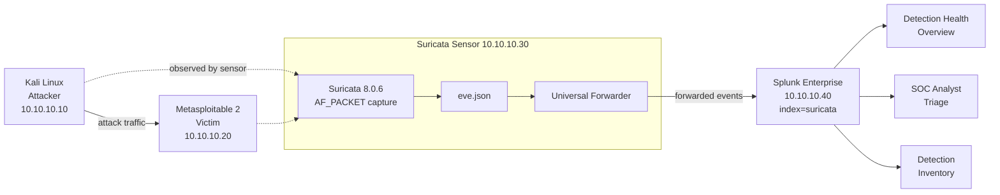

# Detection Engineering Lab: Suricata to Splunk

I built this lab to practise the work a detection engineer actually does. Not just installing an IDS, but getting its telemetry into a SIEM, writing rules that fire on real attack traffic, proving they work, and deciding what to do about the noise that shows up along the way.

Suricata 8 runs on an isolated VirtualBox network and ships EVE JSON to Splunk Enterprise through a Universal Forwarder. On top of that sit four dashboards, seven custom detections covering seven ATT&CK tactics, and a correlation search that ties them together.

One rule I kept to throughout: investigate before tuning. Twice something unexpected showed up in the data, and both times I stopped building and worked out why before changing anything.

## Architecture



| Component | Details |
|---|---|
| Hypervisor | VirtualBox, isolated internal network `10.10.10.0/24` |
| Attacker | Kali Linux, `10.10.10.10` |
| Victim | Metasploitable 2, `10.10.10.20` |
| IDS sensor | Suricata 8.0.6 on Ubuntu 26.04 LTS, `10.10.10.30`, AF_PACKET on `enp0s3` |
| SIEM | Splunk Enterprise 10.4.1 on Ubuntu 26.04 LTS, `10.10.10.40` |
| Transport | Universal Forwarder into a dedicated `suricata` index, sourcetype `suricata:eve` |
| Ingestion latency | 5s minimum, 7s average, 9s maximum from attack to searchable event |

More detail in [docs/architecture.md](docs/architecture.md).

## What I built

**A validated telemetry pipeline.** Capture through to indexed, searchable JSON, with timestamps and nested field extraction checked against raw `eve.json` before I built anything on top of it. I measured the end to end latency rather than assuming it.

**Seven custom Suricata detections** tracing an attacker from reconnaissance through initial access, credential access, execution, command and control, discovery, and persistence. Each one has a writeup covering the research behind it, the rule logic and its trade-offs, how I validated it, and how an analyst would triage the alert. They live in [detections/](detections/).

**A correlation search** that scores attacker progression across stages instead of counting alerts, so it stays quiet during the noisy periods that dominate this environment. See [COR-001](detections/COR-001-recon-to-exploit-chain.md).

**Four dashboards**, each aimed at one audience and one question rather than one dashboard trying to serve everyone: pipeline health, analyst triage, detection inventory, and a risk based kill chain view that sits on top of the correlation search. Covered in [docs/dashboards.md](docs/dashboards.md).

**Two investigations** where the environment did something I did not expect, written up in [docs/investigations.md](docs/investigations.md).

## Dashboards

| Dashboard | Audience | Question it answers |
|---|---|---|
| [Detection Health Overview](docs/dashboards.md#detection-health-overview) | Detection engineering | Is the pipeline alive and behaving normally? |
| [SOC Analyst Triage](docs/dashboards.md#soc-analyst-triage) | SOC analysts | What is happening, and where do I start? |
| [Detection Inventory](docs/dashboards.md#detection-inventory) | Detection engineering | What detections exist, which are noisy, what changed? |
| [Risk Based Kill Chain](docs/dashboards.md#risk-based-kill-chain) | SOC and detection engineering | Which sources are progressing through the kill chain right now? |


## Detections

| ID | Detection | SID | ATT&CK | Tactic |
|---|---|---|---|---|
| [DET-004](detections/DET-004-suspicious-user-agent.md) | Suspicious user agent, known attack tooling | 1000005 | T1595.002 | Reconnaissance |
| [DET-001](detections/DET-001-sql-injection.md) | SQL injection, UNION SELECT in URI | 1000002 | T1190 | Initial Access |
| [DET-007](detections/DET-007-brute-force.md) | Login brute force, rate based | 1000008 | T1110 | Credential Access |
| [DET-002](detections/DET-002-command-injection.md) | Command injection, shell metacharacter in URI | 1000003 | T1059 | Execution |
| [DET-005](detections/DET-005-reverse-shell.md) | Reverse shell payload in HTTP | 1000006 | T1059 / T1071 | Execution / C2 |
| [DET-003](detections/DET-003-directory-traversal.md) | Directory traversal and LFI | 1000004 | T1083 | Discovery |
| [DET-006](detections/DET-006-web-shell.md) | Web shell access | 1000007 | T1505.003 | Persistence |

All seven are deployed and confirmed firing on live attack traffic, tracing an attacker from the first scan through to a web shell dropped for persistence. Every rule went through the same cycle: research, design, write, validate with `suricata -T`, simulate the attack, confirm the alert in Splunk, map to ATT&CK, then decide on tuning. Full ATT&CK coverage in [docs/mitre-mapping.md](docs/mitre-mapping.md).

## Things worth reading

A few parts of this project turned out more interesting than the setup work.

**A bad rule takes down the whole ruleset.** My first command injection rule failed to load because of a semicolon inside a regex character class. Suricata's response was not to skip that one rule, it refused to load any of them. Had I pushed it without validating first, the sensor would have restarted with zero detections active while still reporting healthy. The root cause is in [DET-002](detections/DET-002-command-injection.md#why-the-first-version-failed-to-load).

**The loudest signature in the environment was my own monitoring stack.** Over 5,000 alerts from one signature, which turned out to be Splunk Web talking to itself. I attributed it before touching a suppression, and wrote up why blanket disabling the rule was the wrong fix in [docs/tuning.md](docs/tuning.md).

**A dashboard KPI disagreed with what I knew.** The unique signature count read 3 when I had only ever seen 2. That could have been a broken panel or a real change, and both needed ruling out. It was real, and the investigation is in [docs/investigations.md](docs/investigations.md).

**A correlation search caught a false positive in one of its own inputs.** While validating [COR-001](detections/COR-001-recon-to-exploit-chain.md), a test that should have stayed quiet fired, because my command injection rule was matching Splunk's own `&id=` search URLs as a backgrounded `id` command. The rule was wrong, not the traffic, so I fixed the pattern instead of suppressing it. Written up in [docs/investigations.md](docs/investigations.md) and [DET-002](detections/DET-002-command-injection.md).

**An IDS alert proves attempt, not impact.** All four of my validation attacks returned the same harmless page, because the web root ignores the parameters I was injecting. Every rule fired anyway. That is correct behaviour, and understanding why matters more than it first appears. Covered in [docs/lessons-learned.md](docs/lessons-learned.md).

## Repository layout

```
docs/
  architecture.md      lab topology, sensor spec, pipeline design
  dashboards.md        all three dashboards with their SPL
  detections.md        signature inventory and detection index
  investigations.md    the two investigations
  tuning.md            noise analysis and tuning decisions
  mitre-mapping.md     ATT&CK coverage
  lessons-learned.md
detections/
  DET-001 to DET-004   per detection writeups
  COR-001              correlation search
  rules/local.rules    the custom rules
journal/               engineering journal, OBS-001 to OBS-006
config/                sanitised Suricata, forwarder and Splunk configs
screenshots/
```

All work was done in an isolated lab against intentionally vulnerable systems.
