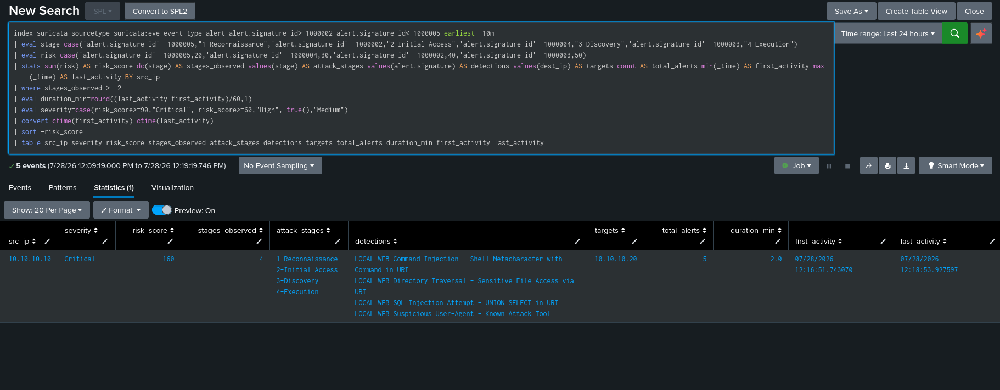

# COR-001: Recon to Exploit Chain

| | |
|---|---|
| Type | Splunk correlation search |
| Inputs | SIDs 1000002 to 1000005 |
| ATT&CK | Chains T1595.002 into T1190, T1059 and T1083 |
| Status | Deployed as a scheduled search |

## The problem

Four detections now fire independently, and individually each one is a single low context alert. A lone suspicious user agent hit is close to noise. An analyst working a flat queue has to notice on their own that the same source IP tripped a scanner signature and then an exploitation signature a few minutes later.

That relationship is the actual signal. One scanner hit is reconnaissance. Reconnaissance followed by exploitation from the same source is an attack in progress, and it should arrive as one prioritised item rather than four rows somebody has to reassemble by eye.

## How it works

The search groups alerts by source IP, scores them by attack stage, and raises something when a source shows progression across stages rather than volume within one.

| Stage | Detection | SID | Score |
|---|---|---|---:|
| Reconnaissance | Suspicious user agent | 1000005 | 20 |
| Discovery | Directory traversal | 1000004 | 30 |
| Initial access | SQL injection | 1000002 | 40 |
| Execution | Command injection | 1000003 | 50 |

Command injection scores highest because it implies code running on the target, which is the worst outcome in this chain. Recon scores lowest because it is cheap, common and frequently harmless by itself.

The trigger is two or more **distinct stages** from one source inside the window, not two or more alerts. That distinction is the whole design. Five hundred repeats of one signature is a noisy scanner and stays where it belongs, while one SQL injection plus one command injection is a real chain and gets escalated.

This matters here specifically. The loudest signature in this environment produces over five thousand benign alerts, so anything triggering on volume would be permanently drowned in Splunk Web talking to itself. Keying on stage progression means the search stays quiet through the noise and still fires on four requests that walk through recon, access and execution.

## The search

```spl
index=suricata sourcetype=suricata:eve event_type=alert alert.signature_id>=1000002 alert.signature_id<=1000005
| eval stage=case(
    'alert.signature_id'==1000005, "1-Reconnaissance",
    'alert.signature_id'==1000002, "2-Initial Access",
    'alert.signature_id'==1000004, "3-Discovery",
    'alert.signature_id'==1000003, "4-Execution")
| eval risk=case(
    'alert.signature_id'==1000005, 20,
    'alert.signature_id'==1000004, 30,
    'alert.signature_id'==1000002, 40,
    'alert.signature_id'==1000003, 50)
| stats sum(risk) AS risk_score
        dc(stage) AS stages_observed
        values(stage) AS attack_stages
        values(alert.signature) AS detections
        values(dest_ip) AS targets
        count AS total_alerts
        min(_time) AS first_activity
        max(_time) AS last_activity
    BY src_ip
| where stages_observed >= 2
| eval duration_min=round((last_activity-first_activity)/60,1)
| eval severity=case(risk_score>=90,"Critical", risk_score>=60,"High", true(),"Medium")
| convert ctime(first_activity) ctime(last_activity)
| sort -risk_score
| table src_ip severity risk_score stages_observed attack_stages detections targets total_alerts duration_min first_activity last_activity
```

A few notes on the SPL itself.

Nested fields are single quoted inside `eval` and `case`. Without the quotes Splunk reads `alert.signature_id` as a path into a nested object and the comparison silently never matches, which is the same nested field trap that showed up during pipeline validation.

`dc(stage)` decides whether it fires and `sum(risk)` decides how it ranks. Keeping those separate means I can tune sensitivity and priority independently instead of having one number do both jobs badly.

The stage labels are numbered so `values()` returns them in attack order rather than alphabetically. Small thing, but it means the result reads as a sequence.

## Validation

I tested this the way it needs to be tested, in both directions: prove it stays quiet when it should, then prove it fires when it should.

**Negative test, single stage.** Fired only reconnaissance from one source (two requests with scanner user agents), then ran the search over a tight window. It returned nothing. One stage does not clear the `stages_observed >= 2` threshold, so no notable, which is the whole point. Volume of a single stage does not trip it.


**Positive test, full chain.** Completed the chain from the same source with SQL injection, directory traversal and command injection, then re-ran the search:

| src_ip | severity | risk_score | stages | attack_stages | targets | duration |
|---|---|---:|---:|---|---|---:|
| 10.10.10.10 | Critical | 160 | 4 | Recon, Initial Access, Discovery, Execution | 10.10.10.20 | 2.0 min |

Four distinct stages from one source against one target, scored 160, ranked Critical. The chain surfaces as a single prioritised row instead of four separate low context alerts.



**What the test taught me about window hygiene.** The first negative test did not come back empty, and the reason was instructive. A correlation search is stateful over its time window, so anything in that window counts. Command injection alerts were being generated by an unrelated source, my own Splunk searches, and they combined with the recon to trip the two stage threshold. Two lessons fell out of that: correlation testing needs a clean window, controlled with a tight `earliest`, and more importantly it exposed a false positive in the command injection rule that I had not noticed on its own. That is written up in [DET-002](DET-002-command-injection.md#tuning-removing-a-false-positive) and [investigations.md](../docs/investigations.md#a-false-positive-the-correlation-search-forced-into-view). A correlation search finding a bug in one of its own inputs is a good argument for building them.

## Deployment

Saved as a scheduled search over a rolling 60 minute window, running every 10 minutes, adding a triggered alert whenever it returns any results. The stanza is in [config/splunk/savedsearches.conf](../config/splunk/savedsearches.conf).

The window needs to be long enough to span an attack that unfolds slowly and short enough to stay actionable. Ten minute cadence sits comfortably above the few seconds of ingestion latency without generating pointless runs. The time range is set as relative (`-60m@m` to `now`), not real time, because scheduled searches reject real time ranges.


After deploying it, I ran the full chain again and confirmed the alert fired and landed in Activity, Triggered Alerts.


One consequence of a 60 minute window worth remembering: re-running the test chain inside that hour merges with the previous run, so testing needs either a wait or a tighter `earliest` while iterating.

This runs on a Splunk Enterprise trial license, which stops scheduled searches once it expires and reverts to the free license. It has no effect on the search itself, but in a real deployment this would run on a licensed instance or a Splunk Cloud stack.

## How an analyst would use it

A triggered result answers the triage questions in one row. `src_ip` and `targets` cover who and what they touched. `attack_stages` and `detections` give the technique sequence in order. `risk_score` and `severity` rank it against everything else in the queue. `duration_min` separates automated tooling running in seconds from someone working by hand over several minutes, which changes how you respond.

From there the pivot is into the [SOC Analyst Triage dashboard](../docs/dashboards.md#soc-analyst-triage), filtered on the offending source IP, to read the underlying alerts.

## Design decisions

**Progression over volume**, for the reasons above. This is the choice that makes the search useful in an environment where the noise floor is high.

**Scoped to my own detections**, SIDs 1000002 to 1000005 only. That keeps it stable against ET ruleset updates and vendor rule churn. Bringing ET signatures in would mean mapping each one to a stage, which is worth doing properly rather than approximately, so I left it out for now.
