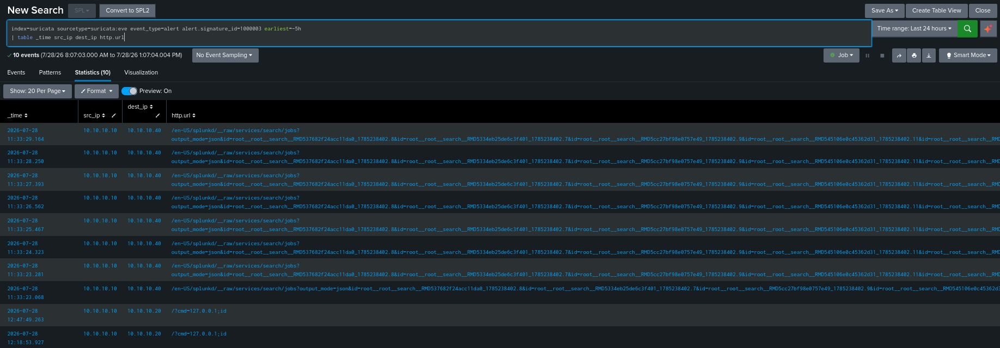

# DET-002: Command Injection, Shell Metacharacter in URI

| | |
|---|---|
| SID | 1000003 |
| ATT&CK | [T1059 Command and Scripting Interpreter](https://attack.mitre.org/techniques/T1059/), Execution |
| Status | Deployed and validated |
| Rule file | `/var/lib/suricata/rules/local.rules` |

## Background

OS command injection happens when a web application passes user input into a system shell without sanitising it, through PHP functions like `system()`, `exec()` or `passthru()`. Metasploitable 2 has several of these, the classic examples being Mutillidae and DVWA's "ping a host" and "DNS lookup" forms that concatenate whatever you type straight into a shell command.

On the wire the pattern is a shell metacharacter followed by a recognisable Unix command.

## Rule design

The regex looks for a shell separator followed by a command:

```
/[\x3b|`]\s*(?:cat|id|whoami|uname|ls|pwd|nc|wget|curl|bash|sh|ping)\b/i
```

The character class covers the metacharacters used to chain a second command in a URL: semicolon for sequential execution, pipe, and backtick for substitution. The semicolon is written as `\x3b` rather than literally, for reasons covered below. `\s*` allows for whitespace between the separator and the command.

The class started out with ampersand in it too, for backgrounding. I removed it after it produced false positives, covered in the tuning section. The short version is that `&` separates query parameters in a URL, so it is a poor injection character and a rich source of noise.

The command list is curated rather than exhaustive. These are the ones that show up in real payloads: `id`, `whoami` and `uname` for working out where you landed, `cat` for reading files, and `wget`, `curl` and `nc` for pulling down a payload or calling home. The `\b` word boundary stops `lsof` matching `ls` or `idea` matching `id`.

This favours precision over recall. An attacker using an uncommon binary gets past it, but the common cases fire cleanly. The first version did produce false positives, traced and fixed in the tuning section below. Like DET-001 it only covers GET style injection in the URI, not POST bodies, which would be a separate rule.

## The rule

```
alert http any any -> $HOME_NET any (msg:"LOCAL WEB Command Injection - Shell Metacharacter with Command in URI"; flow:to_server,established; http.uri; pcre:"/[\x3b|`]\s*(?:cat|id|whoami|uname|ls|pwd|nc|wget|curl|bash|sh|ping)\b/i"; classtype:web-application-attack; sid:1000003; rev:2;)
```

## Why the first version failed to load

I wrote the character class with a literal semicolon, `[;|&`]`, and `suricata -T` rejected it:

```
E: detect-parse: bad option value formatting (possible missing semicolon) for keyword pcre: '"/['
E: detect: error parsing signature "alert http any any -> $HOME_NET any (...)" at line 22
E: suricata: Loading signatures failed.
```

Suricata's rule parser splits options on `;` before PCRE ever compiles the pattern. The semicolon inside my character class terminated the `pcre:` option early, leaving the parser holding the fragment `"/[`. The regex itself was fine. The failure was a layer above it, in rule option tokenisation.

Writing the semicolon as its hex escape `\x3b` fixes it. The rule parser never sees a literal semicolon and PCRE still matches one. Suricata accepts a backslash escaped `\;` as well, but `\x3b` is the form Emerging Threats rules tend to use and it leaves no ambiguity about how the escape unwinds. It validated cleanly after the change.

The part that stuck with me is the failure mode. Suricata did not skip the broken rule, it refused to load any rules at all. If I had pushed this without validating and restarted the service, the sensor would have been running with zero detections while systemd still showed it healthy. One malformed custom rule is a complete detection outage, which is a good argument for the validation step being mandatory rather than a habit.

## Validation

After the fix, `suricata -T` passed and the service restarted cleanly.

Attack from Kali:

```bash
curl "http://10.10.10.20/?cmd=127.0.0.1;id"
```

Confirmed in Splunk:

```spl
index=suricata sourcetype=suricata:eve event_type=alert alert.signature_id=1000003
| table _time src_ip dest_ip http.hostname http.url alert.signature
```

The alert came through with the injected command visible in `http.url`.

Worth noting what the server did, which was nothing interesting. It returned the default Metasploitable page, because the web root does not process a `cmd` parameter and no command was executed. The rule fired regardless, which is the correct behaviour. Suricata inspects the request as it crosses the wire, so the alert means the attempt was observed, not that the target was vulnerable. Validating a detection means confirming the alert in Splunk, not reading the HTTP response.

## Triage notes

`http.url` shows exactly what the attacker tried to run. Something like `;id` or `;cat /etc/passwd` needs no interpretation.

Command injection is blind from the request alone, so establishing whether it worked means looking at the response size and content, and at whether the victim made any outbound connection immediately afterwards. A `wget` or `nc` payload turning into an egress attempt is the escalation signal worth acting on quickly.

Pivoting on `src_ip` for other web attack signatures in the same window is usually productive. Command injection rarely arrives on its own.

## Tuning: removing a false positive

The first version of this rule (rev:1) had `&` in the character class, for shell backgrounding. It generated false positives, and the way I found them is worth recording.

I did not notice them while looking at this detection on its own. They surfaced when I was validating the correlation search [COR-001](COR-001-recon-to-exploit-chain.md), which counts distinct attack stages per source IP. A negative test that should have stayed quiet fired instead, and the reason was eight command injection alerts I had not sent. Tracing them:

```spl
index=suricata sourcetype=suricata:eve event_type=alert alert.signature_id=1000003 dest_ip=10.10.10.40 earliest=-2h
| table _time src_ip dest_ip http.url http.http_user_agent
```

Every one was my own browser hitting the Splunk server, with a Firefox user agent, on this kind of URL:

```
/en-US/splunkd/__raw/services/search/jobs?output_mode=json&id=root__root__search__RMD5...
```

The rule read `&id=` as "background operator, then the `id` command", exactly like a real `& id` injection. Every Splunk search I ran called `...&id=<jobid>` and tripped the rule. The tool I was validating with was generating false positives against the rule I was validating.



The two are easy to tell apart once you see them together. The false positives go to `10.10.10.40`, the Splunk server, on `/services/search/jobs?...&id=` URLs. The real attacks go to `10.10.10.20`, the victim, on `/?cmd=127.0.0.1;id`. Same signature, completely different traffic.

**Root cause.** `&` means two different things. To a shell it backgrounds a process, in a URL it separates query parameters. A GET request that contains `& id` gets split on the `&` by the web server before anything reaches a shell, so `&` is a weak injection vector in a URI and a strong false positive generator. Real command injection through a URL uses `;`, `|` or backticks, which the rule still covers.

**Fix.** Drop `&` from the character class, bump to rev:2. Re-validated in both directions: the `;id` attack still fires, and running searches in Splunk no longer produces command injection alerts on `10.10.10.40`.

**Why not a suppression instead.** I could have suppressed the signature for traffic to the Splunk server, the way I proposed for [SID 2221036](../docs/tuning.md). I did not, because this was not benign traffic tripping a correct rule, it was a genuinely wrong rule. The `&id=` match is a false positive everywhere, not just against my Splunk server, so the right fix is correcting the pattern, not hiding its output for one host. Suppression is for benign traffic on a good rule. This was a bad rule.

This is written up as an investigation in [investigations.md](../docs/investigations.md#a-false-positive-the-correlation-search-forced-into-view).
