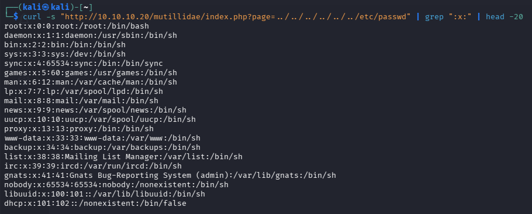
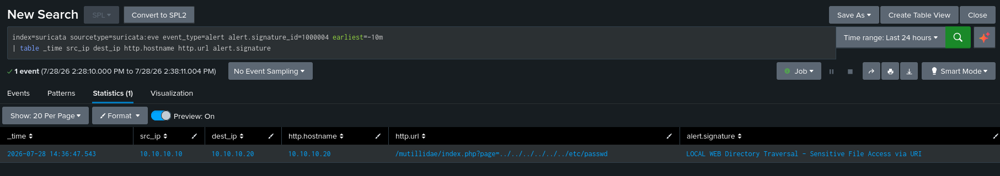

# DET-003: Directory Traversal and Local File Inclusion

| | |
|---|---|
| SID | 1000004 |
| ATT&CK | [T1083 File and Directory Discovery](https://attack.mitre.org/techniques/T1083/), Discovery |
| Status | Deployed and validated |
| Rule file | `/var/lib/suricata/rules/local.rules` |

## Background

Directory traversal uses `../` sequences to climb out of the directory a web application meant to confine you to, and read files elsewhere on the filesystem. `/etc/passwd` is the standard proof of concept on Linux because it is readable and its presence in a response is unmistakable. Mutillidae on Metasploitable 2 has a textbook version of this through its `page=` parameter.

Two forms show up on the wire: literal traversal sequences, and URL encoded ones like `%2e%2e%2f` used to slip past filters that only check for `../`.

## Rule design

The rule matches either a traversal sequence or a known sensitive filename:

```
/(?:\.\.[\/\\]|%2e%2e[\/\\%]|etc\/passwd|boot\.ini)/i
```

`\.\.[\/\\]` catches literal `../` and `..\`. `%2e%2e[\/\\%]` catches the encoded form followed by an encoded or literal separator, which covers `%2e%2e%2f` and the mixed encoding variants. The last two alternatives match direct references to sensitive files on Linux and Windows.

Matching both the technique and the target gives two independent chances to catch the same attack. That matters when the traversal itself has been normalised away by the application or something in front of it, leaving only the filename visible. Neither pattern shows up in normal traffic, so the extra recall costs nothing in precision.

Double encoded payloads like `%252e%252e` get past this. Adding those alternatives would be straightforward if I saw them in practice, but I left them out to keep the pattern readable.

## The rule

```
alert http any any -> $HOME_NET any (msg:"LOCAL WEB Directory Traversal - Sensitive File Access via URI"; flow:to_server,established; http.uri; pcre:"/(?:\.\.[\/\\]|%2e%2e[\/\\%]|etc\/passwd|boot\.ini)/i"; classtype:web-application-attack; sid:1000004; rev:1;)
```

## Validation

`suricata -T` passed and the rule loaded on restart.

Attack from Kali:

```bash
curl "http://10.10.10.20/?file=../../../../../../etc/passwd"
```

Confirmed in Splunk:

```spl
index=suricata sourcetype=suricata:eve event_type=alert alert.signature_id=1000004
| table _time src_ip dest_ip http.hostname http.url alert.signature
```

The alert came through with the traversal sequence visible in `http.url`.

The first time I ran this I aimed it at the web root, which does not process a `file` parameter, so `/etc/passwd` was never returned and the server served its default page. The rule fired on the attempt, which is the right behaviour for request side inspection, but that run only demonstrated detection of an attempt, not a successful read.

So I ran it again against a real sink, Mutillidae's `page` parameter, which is genuinely vulnerable to local file inclusion:

```bash
curl -s "http://10.10.10.20/mutillidae/index.php?page=../../../../../../etc/passwd" | grep ":x:" | head -20
```

This time the victim returned the file. The response body contained Metasploitable's actual `/etc/passwd`, including the privileged accounts:

```
root:x:0:0:root:/root:/bin/bash
...
msfadmin:x:1000:1000:msfadmin,,,:/home/msfadmin:/bin/bash
mysql:x:109:118:MySQL Server,,,:/var/lib/mysql:/bin/false
```



The same rule fired on this request as well, on the `../` and the `etc/passwd` in the URI:



The two runs together make the distinction concrete. Against the web root the rule detected an attempt that could not succeed. Against Mutillidae it detected an attempt that did succeed and disclosed the password file. The rule output was identical in both cases, because the rule only reports what crossed the wire. Whether the attempt actually read a file is answered by the response, and that is analyst work, not something a request side signature can decide. That is the whole reason the triage notes below lead with response size.

## Triage notes

`http.url` shows which file the attacker went after, and `/etc/passwd` is a recon indicator rather than an end goal in itself.

The useful follow up is response size. A large 200 in reply to a request for `passwd` suggests the file came back, which turns an attempt into an incident. A default sized page suggests it did not.

Traversal usually travels with other enumeration, so pivoting on `src_ip` often surfaces scanner activity from the same source. If [DET-004](DET-004-suspicious-user-agent.md) has also fired for that IP, you are looking at tooling rather than someone poking around by hand.

## Tuning

None applied. The `etc/passwd` and `boot.ini` anchors are effectively false positive free.

If an application legitimately used `../` in a query value, which some frontend routers do, I would scope an exception to that host and path rather than dropping the traversal branch from the pattern.
