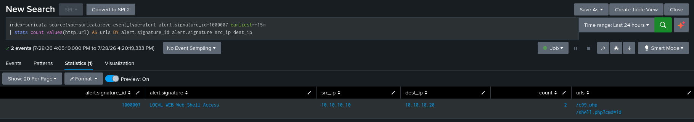

# DET-006: Web Shell Access

| | |
|---|---|
| SID | 1000007 |
| ATT&CK | [T1505.003 Server Software Component: Web Shell](https://attack.mitre.org/techniques/T1505/003/), Persistence |
| Status | Deployed and validated |
| Rule file | `/var/lib/suricata/rules/local.rules` |

## Background

A web shell is a small script an attacker leaves on a compromised web server to keep access. It is persistence: once the shell is planted, they come back to it through the browser and run commands or browse files without re-exploiting anything. Public web shells have been copied around for years, so many of them carry recognisable filenames, `c99`, `r57`, `wso`, `b374k`, `c100`, and generic names like `shell.php` or `backdoor.php`.

Access to a file with one of those names is the network observable. The upload that planted it may have been missed, but every time the attacker uses the shell they make an HTTP request to it, and that request is on the wire.

## Rule design

The rule matches known web shell filenames in the HTTP request URI:

```
/(?:c99|r57|wso|b374k|c100|r0nin|[a-z0-9_-]*shell|backdoor|bindshell)\.(?:php|asp|aspx|jsp)\b/i
```

- The named alternatives are well known public web shells.
- `[a-z0-9_-]*shell` catches the generic cases, `shell.php`, `webshell.php`, `reverse-shell.php`, anything ending in shell.
- The extension group covers the common server side languages, PHP, classic ASP, ASP.NET, and JSP.

Matching on filename rather than behaviour is a deliberate trade. It is cheap, it needs no response inspection, and it catches the reused public shells that show up constantly against exposed servers. It fires on the access attempt whether or not the file actually exists, which is the right behaviour, a request for `c99.php` is worth knowing about even against a server that does not have it.

**Limitation.** An attacker who renames their shell to something innocuous evades this entirely. Filename matching is one layer, good for the common lazy cases and useless against a careful operator. Catching a renamed shell needs behavioural detection, spotting the command-and-response pattern in the traffic, which is a different and harder detection.

## The rule

```
alert http any any -> $HOME_NET any (msg:"LOCAL WEB Web Shell Access"; flow:to_server,established; http.uri; pcre:"/(?:c99|r57|wso|b374k|c100|r0nin|[a-z0-9_-]*shell|backdoor|bindshell)\.(?:php|asp|aspx|jsp)\b/i"; classtype:trojan-activity; sid:1000007; rev:1;)
```

## Validation

`suricata -T` passed and the rule loaded on restart.

Attack from Kali, requesting a named shell and a generic one:

```bash
curl "http://10.10.10.20/c99.php"
curl "http://10.10.10.20/shell.php?cmd=id"
```

Confirmed in Splunk:

```spl
index=suricata sourcetype=suricata:eve event_type=alert alert.signature_id=1000007 earliest=-15m
| table _time src_ip dest_ip http.url alert.signature
```

Both fired, `10.10.10.10` to `10.10.10.20`, with `/c99.php` and `/shell.php?cmd=id` in `http.url`. Both files return 404 on this victim, and the detection fired anyway, which is the point, the access attempt is the signal.



## Triage notes

The first question is whether the request got a 200 or a 404. A 404 is a probe or a scanner walking a shell name list, low urgency. A 200 means the file is actually there, which means the server is already compromised and you are watching the attacker use their backdoor. That is a major escalation and the response size in the following events will usually confirm it.

`http.url` often shows the command too. `shell.php?cmd=id` is the attacker running `id` through the shell, so the parameter tells you what they are doing. Pivot on `src_ip` to see the rest of the session, and check whether any earlier alert from the same source, a traversal or an injection, is how the shell got there in the first place.

## Tuning

None applied. The named shells are effectively false positive free. The generic `shell.php` pattern could in principle match a legitimately named file, so if a real application on this network served something like `my-shell.php`, the fix would be an exception for that exact path rather than dropping the generic branch, which is the branch that catches the cases that matter.
