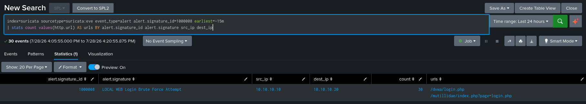

# DET-007: Login Brute Force

| | |
|---|---|
| SID | 1000008 |
| ATT&CK | [T1110 Brute Force](https://attack.mitre.org/techniques/T1110/), Credential Access |
| Status | Deployed and validated |
| Rule file | `/var/lib/suricata/rules/local.rules` |

## Background

Brute force is not a single suspicious request, it is a rate. One failed login is normal, everyone mistypes a password. Twenty failed logins from one source in a minute is an attack. This is the first detection in the set where the signal is volume over time rather than the content of any single packet, so it needs a different tool than the pattern matches the other rules use.

## Rule design

The rule matches an HTTP POST to a URI containing `login`, and wraps it in a `detection_filter` so it only alerts once the rate crosses a threshold:

```
http.method; content:"POST"; http.uri; content:"login"; nocase;
detection_filter:track by_src, count 20, seconds 60;
```

- `http.method` with `content:"POST"` scopes it to form submissions, which is what a login attempt is. It ignores the GET that just loads the login page.
- `http.uri` with `content:"login"` targets login endpoints without hardcoding one application's path, so it matches `/dvwa/login.php` and `/mutillidae/index.php?page=login.php` alike.
- `detection_filter:track by_src, count 20, seconds 60` is the important part. It suppresses the first 19 matching requests from a source and only starts alerting on the 20th within a 60 second window. A handful of failed logins stays quiet, a flood does not.

Tracking `by_src` means the count is per source IP across every login endpoint, not per URL. A single attacker hitting two different login pages has their requests counted together, which is correct, the threat is the source, not the page.

**Limitation.** This catches fast brute force, the kind hydra or a script produces. It does not catch low and slow, an attacker deliberately staying under 20 in 60 seconds, and it does not catch a distributed attempt spread across many source IPs, since each source is counted on its own. It also keys on `login` in the URI, so an application whose auth endpoint is named something else, or that uses HTTP basic auth rather than a form POST, would need the pattern adjusted. Rate thresholds are always a trade between catching the obvious cases and missing the patient ones.

## The rule

```
alert http any any -> $HOME_NET any (msg:"LOCAL WEB Login Brute Force Attempt"; flow:to_server,established; http.method; content:"POST"; http.uri; content:"login"; nocase; detection_filter:track by_src, count 20, seconds 60; classtype:attempted-user; sid:1000008; rev:1;)
```

## Validation

`suricata -T` passed and the rule loaded on restart.

Attack from Kali, a loop of failed login POSTs to cross the threshold:

```bash
for i in $(seq 1 25); do curl -s -o /dev/null -X POST "http://10.10.10.20/dvwa/login.php" -d "username=admin&password=wrong$i&Login=Login"; done
```

Confirmed in Splunk:

```spl
index=suricata sourcetype=suricata:eve event_type=alert alert.signature_id=1000008 earliest=-15m
| stats count values(http.url) AS urls BY src_ip dest_ip alert.signature
```

The alert fired from `10.10.10.10` against `10.10.10.20`. Because the loop sent more than 20 requests inside the window, the `detection_filter` released an alert on the 20th and every one after, so the count reflects the requests past the threshold rather than every request sent. Running a second loop against the Mutillidae login added its endpoint to the same source's tally, and the two login URLs appear together in the results, which confirms the `by_src` tracking is counting across endpoints rather than per URL.



## Triage notes

The count is the story here. `detection_filter` already established that this source crossed a rate threshold, so the alert itself means "someone is hammering a login." The first pivots are how many attempts, over how long, and against which accounts, which comes from the raw events rather than the alert.

The question that decides severity is whether any attempt succeeded. That needs the responses, a 302 redirect or a change in response size among a run of identical failures is the tell that one set of credentials worked. A brute force alert followed by a single different response, then activity from that source, is a successful compromise and a different incident entirely.

## Tuning

None applied, but the threshold is the tuning surface. Count 20 in 60 seconds is a reasonable default for a lab. In production this would be set against the real failed login baseline of the application, high enough that ordinary user fumbling and password manager retries stay quiet, low enough that an actual attack trips it quickly. If it turned out to be noisy, raising the count or shortening the window is the adjustment, both recorded here with the reason, rather than disabling the rule.
