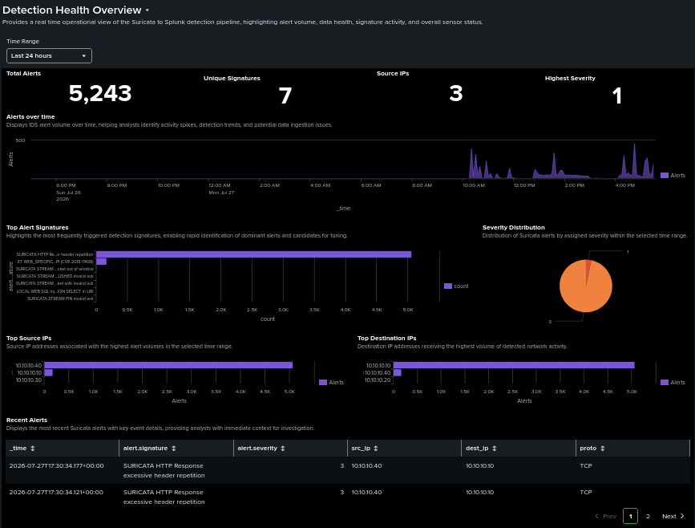
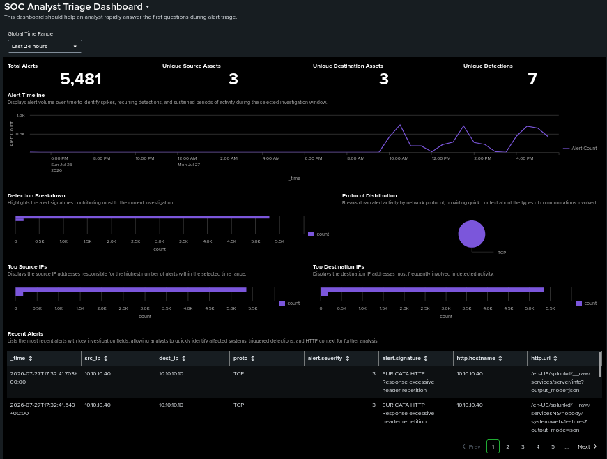
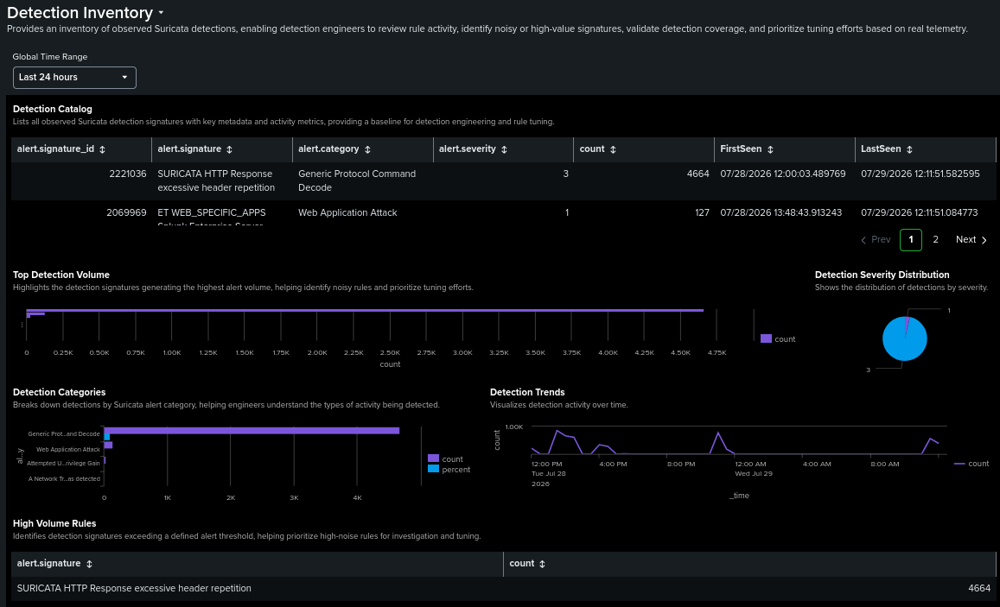
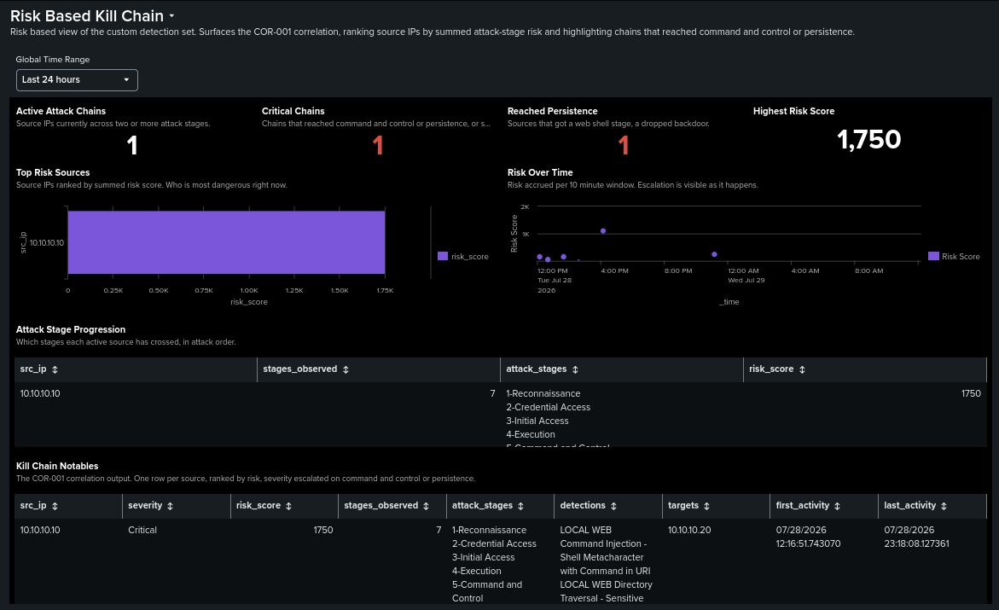

# Dashboards

Four dashboards built in Splunk Dashboard Studio, dark theme, absolute layout. Each one targets a single audience and a single question.

I split them deliberately. One dashboard trying to serve both engineers and analysts ends up serving neither well, and SOCs generally separate the two anyway: engineering watches sensor and pipeline health, analysts work from investigation views. Keeping them apart also means each panel earns its place against one clear purpose. The first three are the operational views. The fourth, the risk dashboard, sits on top of the correlation search and is the one that shows an attack forming.

All panels run off a global time range input over `index=suricata sourcetype=suricata:eve event_type=alert`. The full Dashboard Studio definitions, every panel's exact SPL and layout, are exported to [config/splunk/dashboards](../config/splunk/dashboards).

## Detection Health Overview



This was the first dashboard I built, and its first job was proving the pipeline worked end to end rather than looking good. Alert volume, signature activity, severity spread and sensor status.

Panels:

- KPI row: total alerts, unique signatures, source IPs, and highest severity. The severity KPI runs `stats min(alert.severity)`, which looks backwards until you remember Suricata numbers severity with 1 as the most severe. The minimum value is the highest priority seen, so `min()` is correct.
- Alerts over time, an area chart. Spikes show attack bursts, gaps show ingestion problems.

  ```spl
  index=suricata sourcetype=suricata:eve event_type=alert
  | timechart span=5m count AS Alerts
  ```

- Top alert signatures, which surfaces dominant detections and tuning candidates.

  ```spl
  index=suricata sourcetype=suricata:eve event_type=alert
  | stats count by alert.signature
  | sort -count
  | head 10
  ```

- Severity distribution (`stats count by alert.severity`, pie), top source IPs, top destination IPs, and a recent alerts table.

I cross checked every KPI against ad hoc SPL and raw events rather than trusting the panel. That is how I found the signature count discrepancy described in [investigations.md](investigations.md), which paused dashboard work for a while.

## SOC Analyst Triage



Built for the first few minutes of triage. The panel order follows the sequence an analyst actually asks questions in.

1. **Investigation summary KPIs.** How big is this? Total alerts, unique source assets (`dc(src_ip)`), unique destination assets (`dc(dest_ip)`), and unique detections (`dc(alert.signature_id)`). Asset and detection diversity tells you more than raw count here. A handful of alerts spread across several assets and signature types is a broader problem than a thousand repeats of one rule.
2. **Alert timeline.** When did it happen, and is it still happening? A `timechart count`.
3. **Detection breakdown** (`top limit=10 alert.signature`) and **protocol distribution** (`chart count BY proto`). What kind of activity is this?
4. **Top source and destination IPs**, both `top limit=10`. Which systems are involved?
5. **Recent alerts table.** Where do I start? Newest first (`sort 0 -_time`), with `_time`, `src_ip`, `dest_ip`, `proto`, `alert.severity`, `alert.signature`, plus `http.hostname` and `http.url` so web attacks can be triaged without leaving the panel.

I confirmed every panel populated from the index, that counts matched raw events, that the recent alerts table sorted newest first, and that the visualisations held up across several different time ranges.

## Detection Inventory



An engineering view rather than an analyst one. It inventories every signature seen in the environment so I can review rule activity, spot noisy or high value signatures, and prioritise tuning against real telemetry instead of guesswork.

Panels:

- **Detection catalog.** One row per signature with SID, name, category, severity, count, and first and last seen timestamps, built with `stats count earliest(_time) latest(_time) by alert.signature_id alert.signature alert.category alert.severity`. This is the closest thing the lab has to a detection register, and it is the same query the [detection inventory](detections.md) is enumerated from.
- **Top detection volume** (`top limit=10 alert.signature`). Effectively the tuning priority queue.
- **Severity distribution** and **detection categories** (`top limit=10 alert.category`), which show what kinds of activity are actually being caught.
- **Detection trends** over time, a `timechart count`.
- **High volume rules**, signatures above a set alert threshold, `stats count by alert.signature | where count > 100`. In this lab only the benign header-repetition signature clears that bar, which is itself a useful finding about where the noise comes from.
- **Recently introduced detections**, ordered by first seen (`sort -LastSeen`).

That last panel exists because of the investigation in [investigations.md](investigations.md). A new signature appeared unannounced and I had no quick way to tell when it had started firing. Now "has anything new shown up?" is a question the dashboard answers on its own instead of a surprise during validation.

## Risk Based Kill Chain



The other three dashboards show alerts. This one shows attacks. It sits on top of [COR-001](../detections/COR-001-recon-to-exploit-chain.md) and reuses the same stage scoring, so instead of a flat list of signatures it presents source IPs ranked by how far through the kill chain they have progressed.

I built it last, and it is the one that ties the project together. Seven detections and a correlation search are only useful if someone can see the picture they paint, and until this dashboard existed that picture only lived in triggered alerts. This is the analyst-facing surface of the risk based alerting the correlation search does underneath.

Panels:

- **KPI row.** Active attack chains (sources across two or more stages), critical chains, sources that reached persistence, and the highest current risk score. The two red KPIs, critical chains and reached persistence, are the ones that should be zero on a quiet day.
- **Top risk sources**, a bar of source IPs by summed risk score. Who is most dangerous right now.
- **Risk over time**, a `timechart span=10m sum(risk)`. Escalation shows up as a rising line, which is the shape of an attack unfolding rather than a single spike of noise.
- **Attack stage progression**, a table of which stages each active source has crossed, in attack order. This is where you watch a chain build, recon then an injection then a shell.
- **Kill chain notables**, the full COR-001 output. One row per source, severity escalated to Critical the moment command and control or persistence appears.

The whole dashboard is driven by the same scoring model as the scheduled correlation search, so what an analyst watches here and what fires as a notable are the same logic, which is the point of risk based alerting. The Dashboard Studio definition is in [config/splunk/dashboards/risk-kill-chain.json](../config/splunk/dashboards/risk-kill-chain.json).
